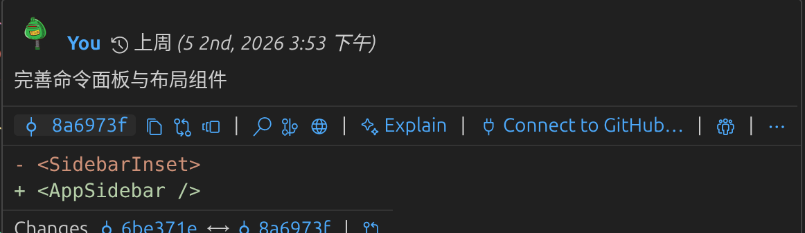

# 鼠标悬停注释

GitLens 提供了丰富的行内 Blame（追溯）注解和悬停提示。

将鼠标悬停在注解上，还能查看提交 ID、快捷操作、提交日期以及完整的提交信息等更多细节。此外，

# GitLens 底部的状态栏显示

GitLens 还在底部的状态栏显示 Blame 详情，你同样可以悬停或点击它来获取更多信息和操作选项。点击编辑器工具栏上的对应图标，你可以开启“文件 Blame（File Blame）”视图。文件 Blame 会在每一行的开头提供详尽的注解，包括提交作者、信息、日期以及带颜色编码的热力图。

toggle:切换
blame:责备
heatmap:热力图
changes:变更

# File Blame

点击编辑器工具栏上的对应图标，你可以开启“文件 Blame（File Blame）”视图。文件 Blame 会在每一行的开头提供详尽的注解，包括提交作者、信息、日期以及带颜色编码的热力图。

与行内 Blame 类似，文件 Blame 同样支持悬停提示，让你在探索历史变更时获得更多上下文。想要关闭文件 Blame，只需再次点击该图标或按下 Esc 键即可。

此外，你还可以点击编辑器工具栏上的箭头图标，直接打开并查看上一次提交的变更。

另外，如果你按住 Alt 键（Mac 上是 Option 键）并点击，就能直接跳转并打开特定提交的变更。这里同样支持行内 Blame 和悬停提示，让浏览历史记录变得既简单又强大。

# 最近更改

点击“最近更改（recent change）”的 CodeLens，可以查看关于最新提交的更多信息，例如提交信息、提交 ID，或是该次提交中所有被修改文件的列表。

类似地，点击“作者（authors）” CodeLens 会切换出之前介绍过的文件 Blame 视图；和之前一样，按 Esc 键即可退出。你还可以通过侧边栏的 GitLens 视图深入洞察你的代码仓库并执行相关操作。

# sidebar views

## 逐字翻译

GitLens groups many related views—Commits, Branches, Stashes, etc—here for easier view management.
GitLens 将许多相关的视图（如 Commits 提交记录、Branches 分支、Stashes 暂存区等）分组汇总到了这里，以便更轻松地进行视图管理。

Continue
继续（点击此按钮代表你接受并使用这种全新的、整合在一起的界面布局）。

Prefer them separate? Restore views to previous locations
更喜欢它们分开显示？点击这里将视图恢复到以前的位置（如果你习惯以前那种每个功能单独占一个面板的老布局，点这个蓝色链接）。

Use the tabs above to navigate, or detach the views you want to keep separated.
使用上方（指标题栏那一排小图标）的标签页进行导航切换，或者将你想要保持独立显示的视图直接拖拽分离出去。

You can regroup them anytime using the 'x' in the view header.
你可以随时点击视图标题栏中的“x”按钮，将它们重新组合到一起。
